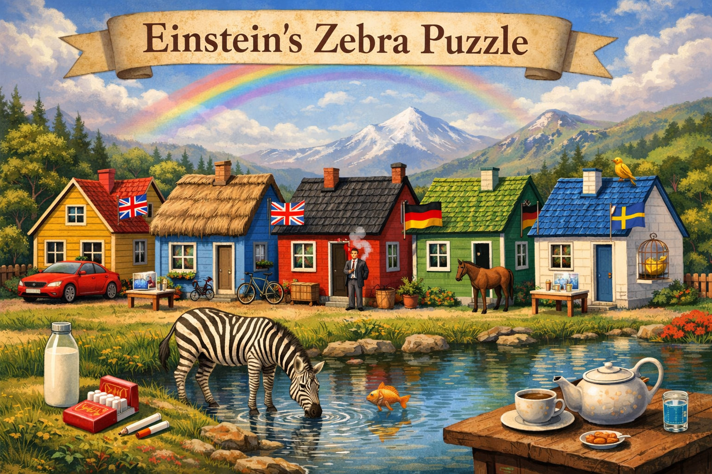

[Home](/) / Shoelaces

## Einstein’s Zebra Puzzle

There are 5 houses in a row, each with a different color. In each house lives a person of a different nationality. Each person drinks a different drink, smokes a different brand of cigarette, and keeps a different pet.

Using the details below, determine **Who Owns the Fish**?

1. The Brit lives in the red house.
2. The Swede keeps dogs as pets.
3. The Dane drinks tea.
4. The green house is on the left of the white house.
5. The green house’s owner drinks coffee.
6. The person who smokes Pall Mall rears birds.
7. The  owner of the yellow house smokes Dunhill.
8. The man living in the center house drinks milk.
9. The Norwegian lives in the first house.
10. The man who smokes Blends lives next to the one who keeps cats.
11. The man who keeps horses lives next to the man who smokes Dunhill.
12. The man who smokes Blue Master drinks beer.
13. The German smokes Prince.
14. The Norwegian lives next to the blue house.
15. The man who smokes Blends has a neighbor who drinks water.

## Hints

This is a logic grid puzzle. You need to systematically deduce house-by-house using the clues. Step-by-step reasoning fills in a table with color, nationality, drink, cigarette, pet.

## Solution

CLICK TO REVEAL

<h2>Answer: The German Owns the Fish</h2>

---

