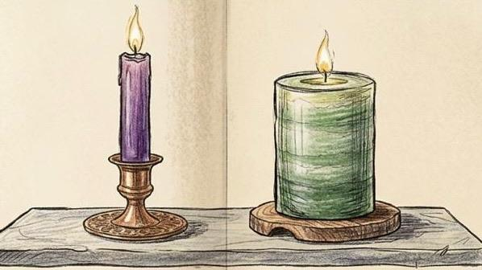

[Home](/) / Melting Candle

## Melting Candles

There are two candles of equal lengths but different thickness. The thicker candle lasts for six hours, while the thinner candle lasts for four hours. A person lights the two candles at the same time and then leaves. After returning home, the person saw that the thicker candle was twice the length of thinner one.

### How long ago did the person light the two candles?

## Hint

When answering these types of questions, remember that they are likely to be answered without the use of a calculator. The answer will likely be a whole number between one and six.

## Solution

CLICK TO REVEAL

**Solution: Three Hours**

The thicker candle has a total burning time of 6 hours, so in one hour it burns 1/6 of its total length. Therefore, after *t* number of hours, the portion of the candle that has burned is t/6, and the remaining length is (6 − t)/6.

Similarly, the thinner candle has a total burning time of 4 hours, so it burns 1/4 of its length per hour. After *t* hours, the portion burned is t/4, and the remaining length is (4 − t)/4.

To understand how values like 4/6 and 3/6 are obtained, we observe the thicker candle over time:

<table>
    <tr>
        <th>Hours</th>
        <th>Thick Candle</th>
        <th>Think Candle</th>
    </tr>
    <tr>
        <td>1 Hour</td>
        <td>5/6</td>
        <td>3/4</td>
    </tr>
    <tr>
        <td>2 Hours</td>
        <td>4/6</td>
        <td>2/4</td>
    </tr>
    <tr>
        <td>3 Hours</td>
        <td>3/6</td>
        <td>1/4</td>
    </tr>
</table>

The answer is three hous as 3/6 (1/2) is twice as high as 1/4.

---

