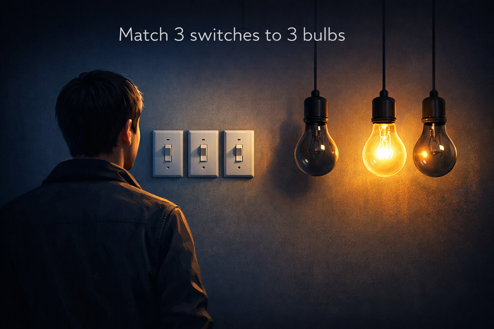

[Home](/) / Three Lights

## Three Lights

The point of this question is to guage your ability to consider a real life situation.

### You are in a room that has three switches and a closed door. The switches control three light bulbs on the other side of the door. Once you open the door, you may never touch the switches again.

### How can you definitively tell which switch is connected to which light bulb?

## Solution

CLICK TO REVEAL

Turn on the first two switches. Leave them on for five minutes. Once five minutes has passed, turn off the second switch, leaving one switch on. Now go through the door. The light that is still on is connected to the first switch. Whichever of the other two is warm to the touch is connected to the second switch. The bulb that is cold is connected to the switch that was never turned on.

## Notes

When answering these types of questions, sometimes there are things outside the given information that need to be taken into account. Ask yourself, why did the question use this setup?

---

